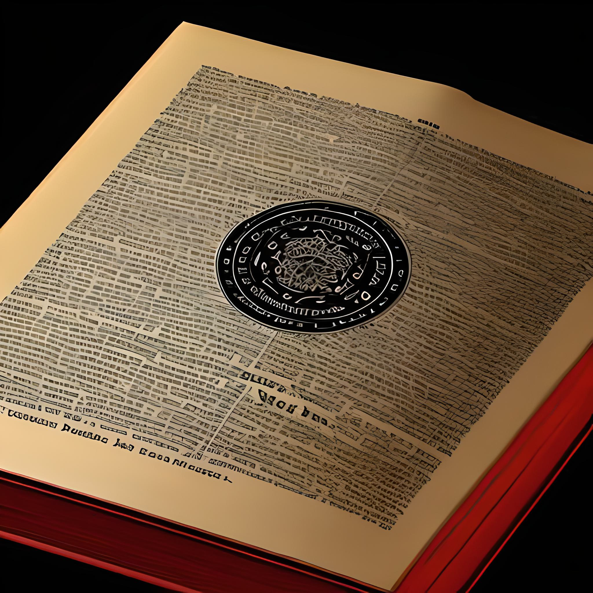

jour::  [2023-01-24](2023-01-24.md)
Week:: [2023-04](2023-04.md)
mots:: 
#250mots
Projet:: #MotW 
Type:: #SN/JDR/MotW/Monstre 
Status:: #WiP 

# Agrippa ou le livre des démons

*L'agrippa est un livre qui contiendrait le nom de tous les démons de l'enfer. Bien sûr, ce sombre savoir fait de l'Agrippa un objet dangereux, littéralement. Le livre serait doué d'une vie propre et ne répondrait qu'à ses propres règles. Ouvrir l'Agrippa est une épreuve mentale pour résister à la puissance de cet artefact.*

*Certaines légendes le décrivent comme un livre rouge à l'écriture noire, grand comme un homme et qui serait personnellement signé par le diable. Toutes s'accorde à dire qu'il faut garder ce livre enchainer et sous cadenas, mais que cela peut ne pas suffire.*

-  *Type* : Trickster (motivation : créer le chaos)
-  *Taille* : Variable
-  *Poids* : Variable
-  *Lieu de prédilection* : On le trouve généralement dans les vieilles églises ou les presbytères.
-  *Autres infos* : En Tréguier, il s'appelle l'_Agrippa_; dans la région de Châteaulin, l'_Egremont_, dont il y a une variante _Egromus_ ; aux alentours de Quimper, _Ar Vif_; dans les parages du haut Léon, _An Negromans_ ; à Plouescat, le livre de l'_igromancerie_.
  
## Pouvoirs

### Jusqu'à ce que la mort nous sépare...
Une personne non religieuse possédant un Agrippa ne peut s'en débarrasser que sur son lit de mort.
À partir du moment où il devient propriétaire de l'ouvrage (souvent mal acquis) chaque tentative de s'en débarrasser sera vouer à l'échec. Lancer dans un lac, il reviendra dans la maison les pages humide. Jeter au feu, les flammes s'écarteront du livre.
De plus, la personne le possédant sent le soufre et la fumée, parce qu'il a commerce avec le diable. 

### Question aux enfers
L'Agrippa contient les noms de tous les diables et enseigne le moyen de les évoquer.
On peut obtenir la réponse à des questions
A l'appel de leurs noms, tous les démons accourent. La personne détenant l'Agripa les interroge un à un.
Pour les congédier, on les appelle de nouveau par leurs noms, mais en commençant par le nom du diable qui est arrivé le dernier, et ainsi de suite.

Lancez 2d6+Weird
- Sur 10+ : Choisissez 3
- Sur 7-9 : Choisissez un.
	- Vous obtenez les réponses à votre question.
	- Vous ne libérez pas un démon.
	- Vous ne sacrifiez pas une partie de votre âme.
	- Vous ne scellez pas le livre de votre sang.
- Sur 6- : Vous êtes entraîné dans les enfers par les démons du livre. 

## Attaque(s)

- L'Agrippa n'attaque pas directement

## Résistance(s)

- Le livre est virtuellement indestructible. Même en poussière, il se reforme pour revenir près de son propriétaire.

## Blessures

☐☐☐☐☐

## Faiblesse(s)

- L'Agrippa peut être détruit s'il a été exorciser et brûler sur un feu de fagot d'ajonc. La cendre doit ensuite être mise dans un sachet et passer au cou du moribond qui possédait le livre pour délivrer son âme.