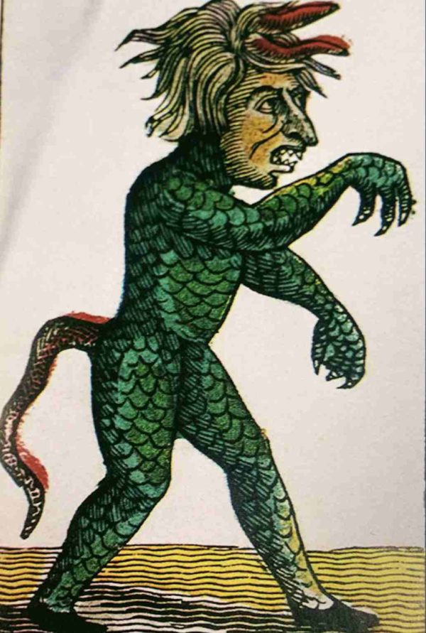

type:: #SN/JDR/MotW/scenario 
status:: #WiP 
#MotW 

***  

# Au Diable Vauvert

_Époque : Révolution Française_

## Histoire

Le château de Vauvert, également appelé château de Val Vert, à proximité de Paris. Au Moyen Âge, on racontait que des actes blasphématoires y étaient commis. 

Il acquit bientôt la réputation d'être hanté.

Saint Louis décida au XIIIe siècle de purifier l’endroit et d’y créer un couvent. La chartreuse de Paris. Les moines enfermèrent les esprits maléfiques dans des pots de confitures.

Fermée et vendue en 1790, la chartreuse devint une usine d'armement.

## Accroche
Sur fond de guerre et de révolution française, la nouvelle usine d'armement ne semble pas aussi productive qu'elle aurait dû. 

Plusieurs ouvriers disparaissent et sont retrouvés le cou tordu. Cela relance les rumeurs sur le fait que l'endroit est hanté.

## Créature

### Le Diable Vauvert
Grand monstre à moitié homme, à moitié serpent avec une grande barbe blanche et armé d'une énorme massue.

**Motivation :** Tortionnaire (motivation : blesser et terrifier)

**Pouvoirs :** Incorporel, force surhumaine

**Résistance :** OOOOOOOOOOOO

**Faiblesse :** Les bocaux en verre lui font peur depuis son séjour forcé dans un pot de confiture, l'odeur de l'ail le repousse, Hellébore fétide, Ellébore fétide ou Pied-de-griffon permet de l'affaiblir et de l'enfermer.

**Attaque :** 
- Massue 3 dégâts
- Poings 2 dégâts

### Pouvoirs

**Constriction**
Si le diable vauvert inflige des dégâts, le personnage lance alors 2d6+Coriace
- 6- : Le diable entoure le personnage de sa queue de serpent et lui inflige 1 point dès que le personnage doit agir. Il peut tenter de relancer pour se libérer.
- 7 à 9 : Le diable frappe de sa queue, infligeant un point de dégât supplémentaire sans arriver à attraper le personnage.
- 10+ : Le personnage esquive le coup de queue mesquin du diable.

## Lieux
1. Les caves de l'usine
2. Les jardins d'arbre fruitier
3. Les forges d'armes
4. Les esplanades de déclamation du conseil des ministres et de l'assemblée.
5. Les travaux d'élargissement des rues
6. La place de la guillotine

## Figurants
1. Cardière Brachet, Ouvrier des chaussées
2. Chalémie Avezou, Lavandière de rue
3. Millet Couret, commère notoire
4. Absynthe Février, contremaitre de l'usine d'armement
5. Jacques Tartelin, moine incognito
6. Marat Pourquery, voisin curieux

## Compte à rebours

**Jour**
Les ouvriers trouve une vieille crypte monastique et ouvrent les bocaux de confiture libérant le Diable Vauvert. Celui-ci tue les ouvriers avant d'errer dans l'Usine

**Pénombre**
Le Diable erre dans l'usine et découvre ce qu'il est advenu de son château, il se fait discret et tente de comprendre ce qui se passe. 

**Crépuscule**
Le Diable assiste à un accident de poudre à canon et décide d'utiliser ceci pour le renforcer grâce au pouvoir du sacrifice.

**Coucher du soleil**
Le Diable commence à tracer des symboles dans les cryptes pour préparer le sacrifice rituel.

**Tombée de la nuit**
Avant la fin de la journée, il ferme les portes de l'usine, empêchant quiconque de rentrer ou de sortir

**Minuit**
Il déclenche un incendie près des barils de poudre, provoquant la mort de tous les employés et récoltant leurs forces vitale par son rituel.

Il est maintenant capable de parcourir le monde, en semant la mort.

# Ressources
