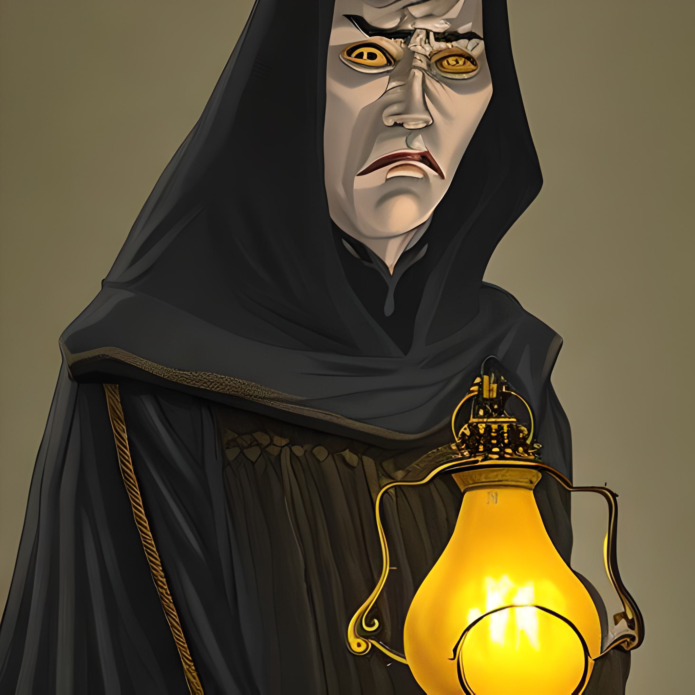

jour::  [2023-01-26](2023-01-26.md)
Week:: [2023-04](2023-04.md)
mots:: 
#250mots
Projet:: #MotW 
Type:: #SN/JDR/MotW/Monstre 
Tags:: #JDR/Création #JDR/Scénario #MotW #WiP #MDF #monstre #writing 
status:: #finished 

# Mange-Temps

*Créature qui déplace les gens dans le temps, elle se nourrit de cette manière.**

*D'apparence, c'est un grand homme vouté ou bossu, enroulé dans une cape noire dégoulinante et portant à la main une lanterne à huile ancienne.* 

*Quand vous apercevez ses grands yeux jaunes aux pupilles en tourbillon sous la capuche sombre de sa cape, c'est qu'il est déjà trop tard.*

-  **Type** : Dévoreur (Dévorer des gens)
-  **Taille** : 1,85 m
-  **Poids** : 250 kg
-  **Lieu de prédilection** : Créature solitaire, il peut souvent être vu dans les lieux d'histoire ou ayant trait au passé.
-  **Autres infos** : Un bruit d'horloge à balancier semble toujours l'accompagner. Comme si chaque seconde tombait telle une goutte d'eau sur une pierre.

## Pouvoirs

### #### Déplacement Temporel
Dès que les gens voient les yeux de la créature, ils sont automatiquement envoyés dans une autre époque.

## Attaque(s)

- Elle fait en sorte que les gens meurent de leur voyage temporel en les envoyant dans les griffes d'autres créatures. 

## Résistance(s)

- Sa cape parait absorber les chocs et les coups, réduisant les dégâts de 2.

## Blessures

☐☐☐☐☐|☐☐☐☐☐ (10)

## Faiblesse(s)

- À chaque fois qu'un mystère est résolu dans le temps où la créature vous a envoyé, elle perd un point de vie et les personnages sont transportés à une autre époque. Quand elle arrive à zéro, elle meurt et les personnages se retrouvent dans leur époque d'origine.
