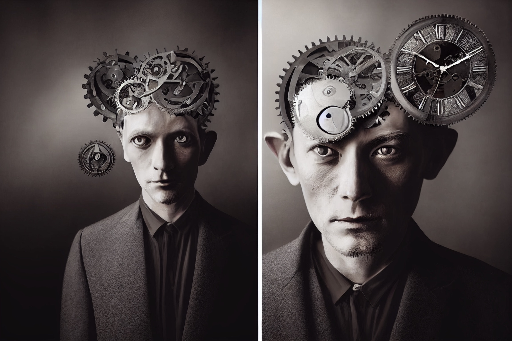

# Immeuble étrange 

Des évènements étranges dans l'immeuble des personnages.
Plutôt organiser par étages.

## Sous-sol

### -2
Demandez-vous pourquoi le syndic de votre immeuble se réunie tous les soirs au niveau -2 du parking. Surtout que sont devenus les chats du quartier ?

### -1
Au -1 il existe un local poussette fermé interdit aux enfants. D'ailleurs personne n'en n'a la clé et personne ne peut expliquer les lueurs changeantes qu'on voit sous la porte certaines nuits.

Au même étage se trouve la chaudière. L'hiver, on y entend des grognements, l'été des ronflements et toute l'année à travers les tuyaux les radiateurs semblent émettre des battements de cœur.

## Rez-de-chaussée

### 0
Le voisin du rez-de-chaussée se vante de pratiquer le vaudou suédois, et c'est vrai que depuis qu'il accroche des rollmops sur la porte, l'ascenseur ne tombe plus en panne. Mais par contre de drôle de bruit sortent de la loge de la gardienne.

## Étages

### 1
Au premier étage, vit un dieu oublié qui collectionne les horloges. Une rumeur dit que si l'on arrive à toutes les réglées sur la même heure, il accordera un vœu. Personne n'est jamais revenu après avoir essayé. Et la collection ne cesse de grandir.

### 2
Au second, vit une femme qui semble vieillir au fur et à mesure de la semaine pour arriver à un âge très avancé le dimanche. Mais le lundi suivant, elle paraît de nouveau avoir 20 ans.

### 3 
Au troisième étage, il y a une tâche d'humidité sur le mur du palier entre les appartements. Si l'on va la regarder à minuit, les nuits de brume, elle forme des mots. Celui qui les lit aura une solution à un de ses problèmes ou disparait.

### 4
Il y a au quatrième une vieille femme aveugle qui fume cigarillos sur cigarillos. Des gens viennent régulièrement la voire avec des cadeaux et des offrandes. Elle serait capable d'effacer des émotions grâce aux yeux noirs qu'elle cache derrière ses verres teintés.